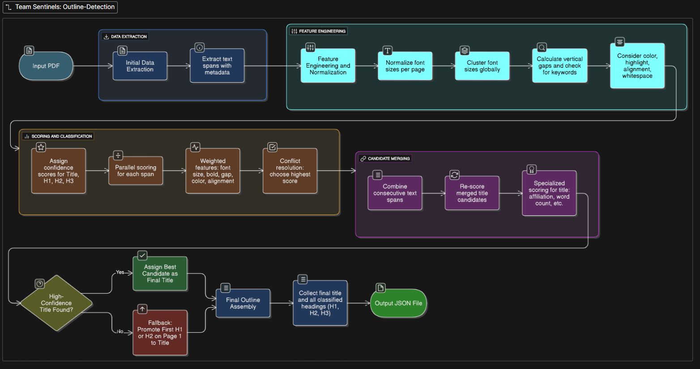

# PDF Outline Detection

A lightweight, rule-based system that extracts structured outlines from PDF documents. The tool automatically identifies document titles and headings (H1, H2, H3) and outputs them in a clean JSON format.

## Features

- **No AI Dependencies**: Uses rule-based heuristics instead of pre-trained models
- **Lightweight & Fast**: Processes documents entirely offline
- **Dockerized**: Consistent execution environment
- **Structured Output**: Clean JSON format with titles and heading hierarchy

## Technical Approach



This solution employs a multi-stage, heuristic-based approach to accurately parse the structure of a PDF without relying on pre-trained models. This ensures the solution is lightweight, fast, and works entirely offline.

### 1. Initial Data Extraction

- Uses the PyMuPDF library to extract all text "spans" from the document.
- For each span, captures text content and rich metadata: font name, size, boldness, color, and bounding box coordinates.

### 2. Feature Engineering & Normalization

- **Normalized Font Size:**  
  Font sizes are normalized per page. The largest font on a page gets a score of 1.0, others are scaled relative to it.
- **Global Font Clustering:**  
  Font sizes across the document are clustered to identify heading levels (e.g., Level 1, Level 2, etc.).
- **Positional & Contextual Cues:**  
  Calculates vertical gap between spans (large gap indicates new section). Checks for linguistic patterns and heading keywords.

### 3. Scoring and Classification

- Each span receives a confidence score for being a title, H1, H2, or H3.
- Scoring factors:
  - High normalized font size and top-level font cluster rank.
  - Bold styling and large vertical gap.
  - First page location boosts title score.

### 4. Candidate Merging

- Headings split across multiple spans are merged based on proximity and consistent styling.

### 5. Title Identification & Fallback

- Title is identified using a specialized scoring function.
- If no clear title is found, the first detected H1 on the first page is promoted to title.

### 6. JSON Output Generation

- Classified and merged headings are formatted into the required JSON structure:
  - Title
  - Outline array with level, text, and page number for each heading.

## Dependencies

This solution uses rule-based heuristics and does **not** require any pre-trained machine learning models.

**Python libraries:**

- `pymupdf` : For PDF text extraction and metadata processing
- `numpy` : For numerical operations and array manipulations
- `scipy` : For scientific computing and advanced mathematical functions
- `pandas` : For data manipulation and analysis

All dependencies are listed in [requirements.txt](requirements.txt) and are installed within the Docker container.

## How to Build and Run

The solution is containerized using Docker for a consistent and reproducible environment.

### 1. Build the Docker Image

Navigate to the root directory (where the Dockerfile is located) and run:

```sh
docker build --platform linux/amd64 -t outline-detection:somerandomidentifier .
```

### 2. Expected Directory Structure

Before running the solution, ensure your directories are organized as follows:

```
root/
├── input/      # Place all your PDF files here
├── output/     # Results will be written here (optional, auto-created)
├── Dockerfile
├── process_pdfs.py # Main script to process PDFs
├── pdf_extractor.py  # Contains the main PDF processing logic
├── utils.py  # Utility functions for processing
├── requirements.txt
└── ...other files
```

### 3. Run the Solution

After building the image:

1. Place all PDF files to process in a local directory (e.g., `input`).
2. Create an empty local directory for results (e.g., `output`).
3. Run the following command from the directory containing your `input` and `output` folders:

   ```sh
   docker run --rm -v $(pwd)/input:/app/input -v $(pwd)/output:/app/output --network none outline-detection:somerandomidentifier
   ```

The script inside the container will process every `.pdf` file in `/app/input` and generate a corresponding `<filename>.json` in `/app/output`.

---

## Output File Format

Each output JSON file will have the following structure, found in the `output` directory:

```json
{
	"title": "<Document Title>",
	"outline": [
		{
			"level": "H1|H2|H3",
			"text": "<Heading Text>",
			"page": "<Page Number>"
		},
		{
			"level": "H1|H2|H3",
			"text": "<Another Heading Text>",
			"page": "<Page Number>"
		}
	]
}
```

- `title`: The detected document title.
- `outline`: Array of headings, each with:
  - `level`: Heading level (`H1`, `H2`, or `H3`)
  - `text`: Heading text
  - `page`: Page number where the heading appears

## Future Enhancements

Plans include incorporating **Ensemble Classifiers** to further improve outline detection accuracy. The outputs from the current classifier can be used as training data to build and refine these ensemble models, enabling more robust and reliable extraction of document structure.

## License

© 2024 PDF Outline Detection Project.  
This project is open source and available under standard open source licensing terms.

---
